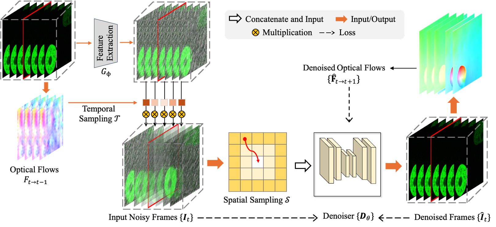
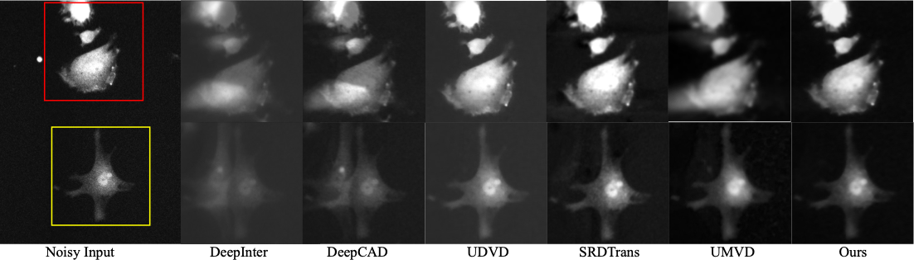
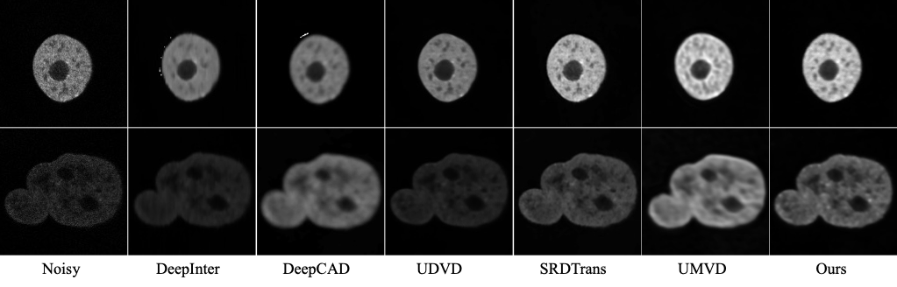
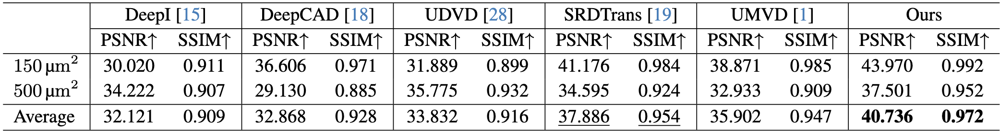

<!-- ✅ MathJax injection for LaTeX rendering -->

<!-- ✅ Add in your index.md just after the front matter `---` -->
<link href="https://cdn.jsdelivr.net/npm/bootstrap@5.3.0/dist/css/bootstrap.min.css" rel="stylesheet">
<link href="https://cdn.jsdelivr.net/npm/bootstrap-icons@1.10.3/font/bootstrap-icons.css" rel="stylesheet">

<h1>Generalizable Unsupervised Microscopy Video Denoising via</h1>
<h1>Weighted SpatioTemporal Sampling</h1>

<!-- <h1 style="display: block;">Unsupervised Microscopy Video Denoising</h1> -->
<table style="border: none; display: initial;">
<tr style="border: none;">
<td style="border: none;"><a href="https://maryaiyetigbo.github.io/">Mary Damilola Aiyetigbo</a>1</td>
<td style="border: none;"><a href="mailto:wanqiy@clemson.edu">Wanqi Yuan</a>1</td>
<td style="border: none;"><a href="mailto:luofeng@clemson.edu">Feng Luo</a>1</td>
<td style="border: none;"><a href="mailto:xli48@albany.edu">Xin Li</a>2</td>
<td style="border: none;"><a href="mailto:ye7@clemson.edu">Tong Ye</a>1</td>
<td style="border: none;"><a href="mailto:nianyil@clemson.edu">Nianyi Li</a>1</td>
</tr>
</table>
 
<table style="border: none; display: initial;">
<tr style="border: none;">
<td style="border: none;">1Clemson University</td>
<td style="border: none;">2Department of Computer Science, University at Albany - State University of New York</td>
</tr>
</table>

 

<table style="border: none; display: initial;">
<tr style="border: none;">
<td style="border: none;">
<a href="#" style="color: #ffffff">

<i class="bi bi-file-earmark-richtext"></i> Paper

</a>
</td>
<td style="border: none; display: initial;">
<a href="https://github.com/maryaiyetigbo/STS-UVD" style="color: #ffffff">

<i class="bi bi-github"></i> Code

</a>
</td>
</tr>
</table>

<!-- ## Two Photon Calcium Imaging
  -->

# Abstract

Medical video denoising is essential for improving image quality and enhancing the reliability of clinical data. However, the limited availability of annotated datasets, the variability of noise patterns, and the absence of ground-truth reference frames present significant challenges for traditional supervised denoising approaches. On the other hand, current unsupervised video denoising methods often struggle to balance noise removal and motion preservation, leading to either excessive smoothing that degrades fine details or insufficient denoising that leaves residual noise.
To address these challenges, we propose STS-UVD, a novel unsupervised video denoising (UVD) method that removes noise while preserving motion integrity. By refining the optical flow, our method ensures temporal consistency without compromising important motion details. Additionally, STS-UVD demonstrates strong generalization across different noise conditions and datasets, making it a robust solution for medical video analysis. Extensive experiments validate its effectiveness in enhancing video quality while maintaining structural and temporal coherence.

## Architecture

Given a noisy video sequence 
$$
\mathbf{I} \in\mathbb{R}^{T \times H \times W \times C}
$$
 where $$T,H,W$$ and $$C$$ are the video length, height, width and channel, respectively, the goal of STS-UVD is reconstruct a denoised video 
$$
\hat{\mathbf{I}} \in\mathbb{R}^{T \times H \times W \times C}
$$.
Our method takes two inputs: video contaminated with unknown noise distribution and the optical flow maps computed using neighboring noisy frames. We denote the input frame as 
$$
\{\mathbf{I}_t\}_1^T
$$, where $$T$$ is the total number of frames in the input video, and the initial optical flow maps as 
$$
\{\mathbf{F}_{t \rightarrow t + 1} \}
$$. 
Our weighted SpatioTemporal Sampling (STS) based unsupervised video denoising method utilizes the coarse 
$$
\{\mathbf{F}_{t \rightarrow t+ 1} \}
$$
 to determine the hyperparameters of the temporal sampling kernel $$\mathcal{T}$$. 
In each iteration, we concatenate each noisy frame $$\mathbf{I}_t$$ with its contiguous neighboring frames, denoted as $$\{\mathbf{I}_{t + i} \}_{-N/2}^{+N/2}$$.
These frames are first processed through a shallow feature extraction module $$G_{\phi}$$, consisting of three layers of group convolutions with 21 channels each, capturing essential low-level features.
Next, we apply the initialized temporal sampling kernel $$\mathcal{T}$$ to refine temporal information, followed by spatial sampling kernel $$\mathcal{S}$$, which enhances spatial consistency in the sampled batch. The resulting features are then passed through the denoising network to reconstruct the clean frame $$\hat{\mathbf{I}}_t$$.
After each epoch, we employ an optical flow consistency check to the denoised video and use the loss to update the network weights in the next round. This recurrent optimization will stop when the optical flow-based consistency loss does not change anymore. 

## Results
<!-- Two Photon Calcium Imaging | Fluorescence Microscopy
:-------------------------:|:-------------------------:
 | 

 Two Photon Calcium Imaging           |  Fluorescence Microscopy
:-------------------------:|:-------------------------:
  |   -->

<!-- ## Video SuperResolution -->

<table style="border: none;">
 <tr style="border: none;"><th align="left" style="border: none;"> Fluorescence Microscopy </th></tr>
 <tr style="border: none;"><td align="left" style="border: none;">  </td></tr>
 <tr style="border: none;"><td align="left" style="border: none;">  </td></tr>
</table> 
 

<!-- <table>
 <tr>
  <th align="center"> Two Photon Calcium Imaging </th>
  <th align="center"> Fluorescence Microscopy </th>
 </tr>
 <tr>
  <td align="center">  </td>
  <td align="center">  </td>
 </tr>
</table> -->

<!-- ## Results on Natural Videos
<table style="border: none;">
 <tr style="border: none;"><th align="left" style="border: none;"> Bobblehead </th></tr>
 <tr style="border: none;"><td align="left" style="border: none;">  </td></tr>
 <tr style="border: none;"><th align="left" style="border: none;"> Runner </th></tr>
 <tr style="border: none;"><td align="left" style="border: none;">  </td></tr>
</table> -->

Quantitative comparison of our method with SOTA video denoising techniques on simulated two-photon calcium imaging datasets with varying fields of view (FOV). Text highlighted in **bold** signifies the highest value, while underlined text denotes the second highest..